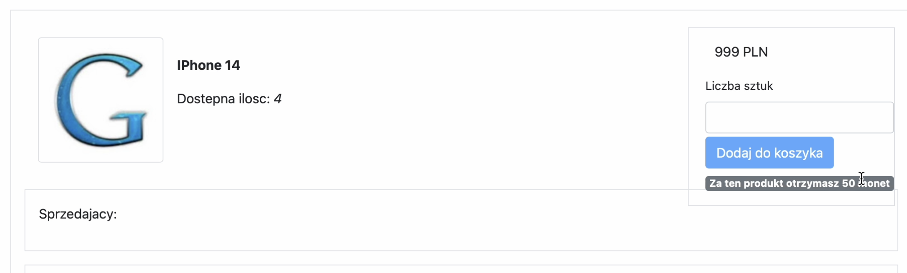

# gShop Project
> A online shop application based on Spring Boot and Angular.
> Heroku Live demo [_here_](https://shop-front-build.herokuapp.com). <!-- If you have the project hosted somewhere, include the link here. -->

## Table of Contents
* [General Info](#general-information)
* [Technologies Used](#technologies-used)
* [Features](#features)
* [Screenshots](#screenshots)
* [Usage](#usage)
* [Project Status](#project-status)
* [Room for Improvement](#room-for-improvement)
* [Contact](#contact)
<!-- * [License](#license) -->

## General Information
-  My role was to create all backend and few frontend features (Cart and Auctions)
- Group project build in accordance to scrum methodology.
- Designed to manage products, user’s accounts, adding products to cart, and order processing. 
<!-- You don't have to answer all the questions - just the ones relevant to your project. -->

## Technologies Used
Backend
- Java 8-11
- Spring Boot
- Hibernate
- SQL
- JUnit
- Maven
- Mockito
- AOP 
- REST
- LiquidBase
- Postgres
- Pgadmin
- Sonar

Frontend 
- Angular 11
- Boostrap

## Features
List the ready features here:
- Adding product to shop
- Selling products
- Cart
- Order history
- Auctions
- Login/Logout
- Sending message to shop 
- adding comments

## Screenshots

<!-- If you have screenshots you'd like to share, include them here. -->

## Usage
https://shop-front-build.herokuapp.com

Credentials:
Login: admin  
password: admin

## Project Status
Project is: _in progress_.

## Room for Improvement
Include areas you believe need improvement / could be improved. Also add TODOs for future development.

Room for improvement:
- better frontend

To do:
- bonus coins system
- searching products by title

## Contact
Created by [@telusmikolaj](https://www.linkedin.com/in/miko%C5%82aj-telus-84aa7122b) - feel free to contact me!

